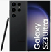
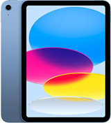

# 📱 Android Command Line Tools & Galaxy S23 Ultra Emulator Setup


This guide explains how to install the Android command line tools, download the Android Emulator, set up environment variables, and create an emulator that mimics the **Galaxy S23 Ultra**.

---

## 📥 Step 1: Download & Install Android Command Line Tools

1. Download the **Android Command Line Tools** from the [official site](https://developer.android.com/studio#command-tools).  
2. Extract to the following directory (mandatory):

```

C:\Android\cmdline-tools\latest

```

3. Set environment variables:
- `ANDROID_SDK_ROOT = C:\Android`
- Add to **PATH**:

```

%ANDROID_SDK_ROOT%\cmdline-tools\latest\bin

````

4. Verify installation:

```bash
sdkmanager --list
````

5. **Run CMD/Terminal as Administrator** when using sdkmanager.

---

## 📦 Step 2: Download Android Emulator (Standalone)

| Platform                        | File Name                              | Size   |
| ------------------------------- | -------------------------------------- | ------ |
| **Linux**                       | `emulator-linux_x64-14184492.zip`      | 326 MB |
| **Mac (Intel)**                 | `emulator-darwin_x64-14184492.zip`     | 408 MB |
| **Mac (Apple Silicon / M1/M2)** | `emulator-darwin_aarch64-14184492.zip` | 325 MB |
| **Windows (64-bit)**            | `emulator-windows_x64-14184492.zip`    | 450 MB |

### ⚡ Install Steps:

1. Extract the zip to:

   * Windows: `C:\Android\emulator`
   * Linux/Mac: `~/Android/emulator`

2. Add the emulator folder to your **PATH**:

   * Windows:

   ```
   C:\Android\emulator
   ```

   * Linux/Mac:

   ```bash
   export PATH=$PATH:~/Android/emulator
   ```

3. Verify:

```bash
emulator -list-avds
```

4. Launch your emulator:

```bash
emulator -avd <AVD_NAME>
```

---

## 📌 Step 3: API Level Setup

* **Android 13 (Older S23 Ultra OS) – API 33**

```bash
sdkmanager "platform-tools" "platforms;android-33" "emulator" "system-images;android-33;google_apis;x86_64"
```

* **Android 14 (Current S23 Ultra OS) – API 34**

```bash
sdkmanager "platform-tools" "platforms;android-34" "emulator" "system-images;android-34;google_apis;x86_64"
```

* **Android 15 Preview – API 35**

```bash
sdkmanager "platform-tools" "platforms;android-35" "emulator" "system-images;android-35;google_apis;x86_64"
```

* **Android 15 Preview – API 36**

```bash
sdkmanager "platform-tools" "platforms;android-36" "emulator" "system-images;android-36;google_apis;x86_64"
```

---

## 📌 Accept All SDK Licenses

Run the following command to accept all licenses:

```bash
sdkmanager --licenses
```

---

## 📱 Step 4: Galaxy S23 Ultra / iPad 2025 / iPhone 17





### Galaxy S23 Ultra


* **Screen size:** 6.8"
* **Resolution:** 3088 × 1440 (QHD+)
* **Density:** ~500+ ppi → `xxxhdpi (560 dpi)`
* **CPU:** ARM64 (Snapdragon / Exynos), emulator uses `x86_64` system images for performance

---

### iPhone 17


* **Screen size:** 6.3"
* **Resolution:** 2622 × 1206
* **Density:** ~460 ppi → `xxxhdpi (460 dpi)`
* **CPU:** Apple A19, emulator uses `x86_64` system images for performance

---

### iPad 2025


* **Screen size:** 11.0"
* **Resolution:** 2360 × 1640
* **Density:** ~264 ppi → `xxhdpi (264 dpi)`
* **CPU:** Apple A16 Bionic, emulator uses `x86_64` system images for performance

---

## 🚀 Step 5: Create a Custom Galaxy S23 Ultra Emulator

### 1️⃣ Create the AVD

```bash
avdmanager create avd -n "S23Ultra_API34" \
  -k "system-images;android-34;google_apis;x86_64" \
  -d "pixel_6_pro" \
  --device "pixel_6_pro"
```

> Pixel 6 Pro is the closest match in size and DPI.

---

### 2️⃣ Custom `config.ini`

Overwrite the generated `config.ini` in your AVD folder:

* **Linux/Mac:** `~/.android/avd/S23Ultra_API34.avd/config.ini`
* **Windows:** `%USERPROFILE%\.android\avd\S23Ultra_API34.avd\config.ini`

```ini
avd.ini.encoding=UTF-8
hw.device.name=Galaxy S23 Ultra
hw.device.manufacturer=Samsung
hw.lcd.width=1440
hw.lcd.height=3088
hw.lcd.density=560
hw.screen.size=6.8
hw.gpu.enabled=yes
hw.gpu.mode=auto
hw.ramSize=4096
hw.cpu.arch=x86_64
hw.cpu.ncore=4
hw.keyboard=yes
hw.mainKeys=no
hw.trackBall=no
hw.sensors.orientation=yes
hw.sensors.proximity=yes
hw.sensors.gyroscope=yes
hw.sensors.accelerometer=yes
hw.sensors.magnetic_field=yes
hw.battery=yes
vm.heapSize=256
skin.name=1080x2400
skin.dynamic=yes
disk.dataPartition.size=8G
image.sysdir.1=system-images/android-34/google_apis/x86_64/
tag.id=google_apis
tag.display=Google APIs
abi.type=x86_64
playstore.enabled=false
showDeviceFrame=no
```

---

### 3️⃣ Create First AVD: S23Ultra_API34

```bash
avdmanager create avd -n "S23Ultra_API34" -k "system-images;android-34;google_apis;x86_64"
```

---

### 4️⃣ Create Second AVD: Pixel 8

```bash
avdmanager create avd -n "Pixel_8_API34" -k "system-images;android-34;google_apis;x86_64" -d "pixel_8"
```

---

### 5️⃣ Start or Restart the Emulator

**Option 1:** Run the script in the project root:

```cmd
start_S23Ultra_emulator.cmd
```

**Option 2:** Start directly via command line:

```bash
emulator -avd S23Ultra_API34 -port 5555
emulator -avd Pixel_8_API34 -port 5566 
```

---

### 6️⃣ Verify Signed APK Using `jarsigner`

```bash
jarsigner -verify -verbose -certs D:\Projects\ar_mobile_cast\deploy\ARMobile-1.0.apk
```

---

### 7️⃣ Install APKs to the Emulator

```bash
adb install D:\Projects\ar_mobile_cast\deploy\ARMobile-1.0.apk
```

---

### 8️⃣ List Emulators

```bash
emulator -list-avds
```

---

### 9️⃣ Kill Emulators

```bash
adb -s emulator-5554 emu kill
```

---

### 10️⃣ Important Tools

*(Same table as before with sdkmanager, avdmanager, etc.)*

---

## ⚠️ Troubleshooting

---

### 🔴1️⃣ **Emulator Package Installed in Wrong Folder**

**Problem:**
When running `sdkmanager` you might see:

```
Warning: Package "Android Emulator" (emulator) should be installed in
"C:\Android\emulator" but
it already exists.
Installing in "C:\Android\emulator-2" instead.
```

This happens because the SDK manager detects an **old or duplicate emulator folder**. The AVD manager expects the emulator to be in `…\emulator`, so `emulator-2` causes errors when creating AVDs.

**Folder Structure Illustration Before Fix:**

```
C:\Android
├─ emulator         <-- old or corrupted emulator folder
├─ emulator-2       <-- newly installed emulator (by sdkmanager)
└─ platform-tools
```

**Folder Structure After Fix:**

```
C:\Android
├─ emulator-old     <-- renamed old emulator
├─ emulator         <-- newly installed emulator renamed from emulator-2
└─ platform-tools
```

**Steps to Fix:**

1. **Check your SDK folder** (`C:\Android`).

2. **Delete or rename** the old/corrupted `emulator` folder:

   ```
   C:\Android\emulator  → rename to emulator-old
   ```

3. **Rename the new folder**:

   ```
   C:\Android\emulator-2  → C:\Android\emulator
   ```

4. **Verify environment variables**:

   * `ANDROID_SDK_ROOT = C:\Android`
   * `PATH` includes:

     ```
     C:\Android\emulator
     C:\Android\platform-tools
     C:\Android\cmdline-tools\latest\bin
     ```

5. **Open a new terminal** and check:

   ```bash
   emulator -version
   avdmanager list targets
   ```

The warning should no longer appear, and AVD creation will work correctly.

---

### 🔴2️⃣ **Emulator Hypervisor / Hardware Acceleration Not Installed**

**Problem:**
When starting the emulator, you might see:

```
ERROR | x86_64 emulation currently requires hardware acceleration!
CPU acceleration status: Android Emulator hypervisor driver is not installed on this machine
More info: https://developer.android.com/studio/run/emulator-acceleration#vm-windows
```

This means the emulator cannot use **CPU virtualization** (Intel HAXM, Hyper-V, or AMD Hypervisor), which is required for running x86/x86_64 system images.

---

Here’s the updated version with **✅ green check icons** for all OS-specific steps for a consistent look:

---

**Solutions by Operating System:**

#### 🪟 Windows

✅ 1. Ensure **virtualization is enabled in BIOS/UEFI** (Intel VT-x or AMD-V).

* Check in Task Manager → Performance tab → *Virtualization: Enabled*
* Or run:

```bash
systeminfo | find "Virtualization"
```

✅ 2. Install the **Android Emulator Hypervisor Driver** using `sdkmanager`:

```bash
sdkmanager --install "extras;google;Android_Emulator_Hypervisor_Driver"
```

✅ 3. Run the installer directly from CMD (Admin):

```bash
cd %ANDROID_SDK_ROOT%\extras\google\Android_Emulator_Hypervisor_Driver
silent_install.bat
```

If successful, it will print:

```
The Hypervisor driver was successfully installed.
```

✅ 4. If the above fails, you can also install via **DISM** (built-in Windows tool):

```bash
dism.exe /Online /Enable-Feature:Microsoft-Hyper-V /All
dism.exe /Online /Enable-Feature:HypervisorPlatform /All
dism.exe /Online /Enable-Feature:VirtualMachinePlatform /All
```

Reboot your machine after enabling these.

✅ 5. Verify installation:

```bash
emulator -accel-check
```

Output should confirm:

```
Hypervisor found and operational
```

---

#### 🐧 Linux

✅ 1. Install **KVM (Kernel Virtual Machine)**:

```bash
sudo apt install qemu-kvm libvirt-daemon-system libvirt-clients bridge-utils virt-manager
```

✅ 2. Check if KVM is working:

```bash
egrep -c '(vmx|svm)' /proc/cpuinfo
```

A number >0 means virtualization is supported.

✅ 3. Add your user to the `kvm` group:

```bash
sudo usermod -aG kvm $USER
```

---

#### 🍎 macOS

✅ 1. Virtualization is built-in (Hypervisor.framework).
✅ 2. Ensure you’re running the emulator with an **x86_64 image** or ARM (M1/M2 → use ARM images instead).

---

**Verify After Fix:**
Run:

```bash
emulator -accel-check
```

Expected output should confirm that a hypervisor (Intel HAXM, KVM, Hyper-V, or Apple Hypervisor) is available and working.

✅ You now have **hardware acceleration enabled**, and your emulator will start without the x86_64 error.

---

✅ You now have a fully functional **Android Emulator mimicking the Galaxy S23 Ultra**, ready for testing and development.

---
