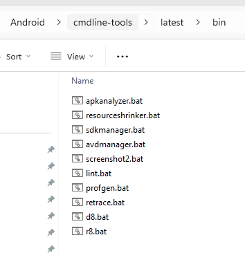

# 📱 Android Command Line Tools & Galaxy S23 Ultra Emulator Setup


This guide explains how to install the Android command line tools, download the Android Emulator, set up environment variables, and create an emulator that mimics the **Galaxy S23 Ultra**.

---

## 📥 Step 1: Download & Install Android Command Line Tools

1. Download the **Android Command Line Tools** from the [official site](https://developer.android.com/studio#command-tools).  
2. Extract to the following directory (mandatory):
```

C:\Android\cmdline-tools\latest

````
3. Set environment variables:
- `ANDROID_SDK_ROOT = C:\Android`
- Add to **PATH**:
  ```
  %ANDROID_SDK_ROOT%\cmdline-tools\latest\bin
  ```
4. Verify installation:
```bash
sdkmanager --list
````

5. **Run CMD/Terminal as Administrator** when using sdkmanager.

---

## 📦 Step 2: Download Android Emulator (Standalone)

| Platform                        | File Name                              | Size   |
| ------------------------------- | -------------------------------------- | ------ |
| **Linux**                       | `emulator-linux_x64-14184492.zip`      | 326 MB |
| **Mac (Intel)**                 | `emulator-darwin_x64-14184492.zip`     | 408 MB |
| **Mac (Apple Silicon / M1/M2)** | `emulator-darwin_aarch64-14184492.zip` | 325 MB |
| **Windows (64-bit)**            | `emulator-windows_x64-14184492.zip`    | 450 MB |

### ⚡ Install Steps:

1. Extract the zip to:

   * Windows: `C:\Android\emulator`
   * Linux/Mac: `~/Android/emulator`
2. Add the emulator folder to your **PATH**:

   * Windows:

     ```
     C:\Android\emulator
     ```
   * Linux/Mac:

     ```bash
     export PATH=$PATH:~/Android/emulator
     ```
3. Verify:

   ```bash
   emulator -list-avds
   ```
4. Launch your emulator:

   ```bash
   emulator -avd <AVD_NAME>
   ```

---

## 📌 Step 3: API Level Setup

* **Android 13 (Older S23 Ultra OS) – API 33**

  ```bash
  sdkmanager "platform-tools" "platforms;android-33" "emulator" "system-images;android-33;google_apis;x86_64"
  ```

* **Android 14 (Current S23 Ultra OS) – API 34**

  ```bash
  sdkmanager "platform-tools" "platforms;android-34" "emulator" "system-images;android-34;google_apis;x86_64"
  ```

* **Android 15 Preview – API 35**

  ```bash
  sdkmanager "platform-tools" "platforms;android-35" "emulator" "system-images;android-35;google_apis;x86_64"
  ```

* **Android 15 Preview – API 36**

  ```bash
  sdkmanager "platform-tools" "platforms;android-36" "emulator" "system-images;android-36;google_apis;x86_64"
  ```

## 📌 Accept All SDK Licenses
Run the following command to accept all licenses:

```bash
sdkmanager --licenses
```

---

## 📱 Step 4: Galaxy S23 Ultra Specs


* **Screen size:** 6.8"
* **Resolution:** 3088 × 1440 (QHD+)
* **Density:** ~500+ ppi → `xxxhdpi (560 dpi)`
* **CPU:** ARM64 (Snapdragon / Exynos), emulator uses `x86_64` system images for performance

---

## 🚀 Step 5: Create a Custom Galaxy S23 Ultra Emulator

### 1️⃣ Create the AVD

```bash
avdmanager create avd -n "S23Ultra_API34" \
  -k "system-images;android-34;google_apis;x86_64" \
  -d "pixel_6_pro" \
  --device "pixel_6_pro"
```

> Pixel 6 Pro is the closest match in size and DPI.

---

### 2️⃣ Custom `config.ini`

Overwrite the generated `config.ini` in your AVD folder:

* **Linux/Mac:** `~/.android/avd/S23Ultra_API34.avd/config.ini`
* **Windows:** `%USERPROFILE%\.android\avd\S23Ultra_API34.avd\config.ini`

```ini
avd.ini.encoding=UTF-8
hw.device.name=Galaxy S23 Ultra
hw.device.manufacturer=Samsung
hw.lcd.width=1440
hw.lcd.height=3088
hw.lcd.density=560
hw.screen.size=6.8
hw.gpu.enabled=yes
hw.gpu.mode=auto
hw.ramSize=4096
hw.cpu.arch=x86_64
hw.cpu.ncore=4
hw.keyboard=yes
hw.mainKeys=no
hw.trackBall=no
hw.sensors.orientation=yes
hw.sensors.proximity=yes
hw.sensors.gyroscope=yes
hw.sensors.accelerometer=yes
hw.sensors.magnetic_field=yes
hw.battery=yes
vm.heapSize=256
skin.name=1080x2400
skin.dynamic=yes
disk.dataPartition.size=8G
image.sysdir.1=system-images/android-34/google_apis/x86_64/
tag.id=google_apis
tag.display=Google APIs
abi.type=x86_64
playstore.enabled=false
showDeviceFrame=no
```

---

### 3️⃣  Create First the AVD with `avdmanager` S23Ultra_API34

```bash
avdmanager create avd -n "S23Ultra_API34" -k "system-images;android-34;google_apis;x86_64"
```

---

### 4️⃣  Create Second the AVD with `avdmanager`  Pixel 8 emulator

```bash
avdmanager create avd -n "Pixel_8_API34" -k "system-images;android-34;google_apis;x86_64" -d "pixel_8"
```


### 5️⃣ Start or Restart the Emulator Kill/Restart ADB

You can start or restart your S23 Ultra emulator using **either** of the following:

**Option 1:** Run the script in the project root (recommended, handles ADB as well):

```cmd
start_S23Ultra_emulator.cmd
```

**Option 2:** Start the emulator directly via command line:

```bash
emulator -avd S23Ultra_API34 -port 5555

emulator -avd Pixel_8_API34 -port 5566 
```

---

Tip: The script ensures the emulator is ready and ADB is running.
Direct command just starts the emulator without checking ADB status.

---

### 6️⃣ Verify Signed Using jarsigner

```bash
jarsigner -verify -verbose -certs D:\Projects\ar_mobile_cast\deploy\ARMobile-1.0.apk
```

---

### 7️⃣ Install APKs to the Emulator

```bash
adb install D:\Projects\ar_mobile_cast\deploy\ARMobile-1.0.apk
```

---

### 8️⃣ List Emulators

```bash
emulator -list-avds
```

---

### 9️⃣ Kill Emulators

```bash
adb -s emulator-5554 emu kill
```

---

> ⚠️ If you get `'sdkmanager' is not recognized`, make sure your PATH includes the **sdkmanager** folder (`C:\Android\cmdline-tools\latest\bin` or `~/Android/cmdline-tools/latest/bin`).

> ⚠️ If you get `'emulator' is not recognized`, make sure your PATH includes the **emulator*8 folder (`C:\Android\emulator` or `~/Android/emulator`).

> ⚠️ If you get `'adb' is not recognized`, make sure your PATH includes the **adb** folder (`C:\Android\platform-tools` or `~/Android/platform-tools`).

---

### 10️⃣ Important Tools: SDK Manager, etc.

> ⚠️ Note: Ensure your PATH includes the `cmdline-tools/latest/bin` folder so that these `.bat` files can be run from any terminal.

Below is a description of the `.bat` files located in your Android SDK folder (`cmdline-tools/latest/bin`):

| File                     | Purpose                                                                                                              |
| ------------------------ | -------------------------------------------------------------------------------------------------------------------- |
| **apkanalyzer.bat**      | Analyze APK files (size, resources, manifest, classes, etc.). Useful for optimization and inspection.                |
| **resourceshrinker.bat** | Removes unused resources from your APK to reduce size. Usually used with ProGuard/R8.                                |
| **sdkmanager.bat**       | Command-line tool to install, update, and manage Android SDK packages (platforms, build-tools, system images, etc.). |
| **avdmanager.bat**       | Command-line tool to create, delete, and manage Android Virtual Devices (emulators).                                 |
| **screenshot2.bat**      | Capture screenshots from a connected device or emulator.                                                             |
| **lint.bat**             | Runs Android Lint checks on your project to find code, layout, and performance issues.                               |
| **profgeng.bat**         | Generates profiling data, mostly for advanced performance tuning.                                                    |
| **retrace.bat**          | De-obfuscates stack traces that were obfuscated by ProGuard/R8. Useful for debugging crash logs.                     |
| **d8.bat**               | Converts Java bytecode (`.class` files) into optimized DEX files for Android.                                        |
| **r8.bat**               | Code shrinker, optimizer, obfuscator, and dexer. Combines ProGuard and D8 features.                                  |

---



---

✅ You now have a fully functional **Android Emulator mimicking the Galaxy S23 Ultra**, ready for testing and development.
